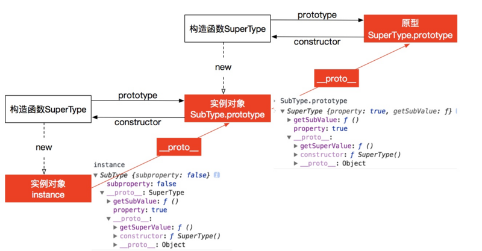

# JavaScript常用的八种继承方案

## 定义

首先我们约定一下接下来使用到的符号的含义：

1. `===`: 上面的线是 `prototype` 线段（方向省略了，下同），下面的线是 `constructor` 线段
2. `/`: `__proto__` 线段
3. `|` : 实例属性的继承
2. ` + properties`: 增加属性

*基本上，这些符号与下图中的有向线段一一对应：*



## 1、原型链继承

```js
            superType ==== superType.prototype
                 |           / 
subType ==== new superType() + properties
  |         /
new subType()
```

由图可知，subType 的原型是 superType 的实例，再加上了一些属性。所以缺点是：
- 多个 subType 实例对原型类型的操作会改变这个实例（subType 的原型）。

## 2、借用构造函数继承

```js
superType
|				
| subType
|  |    
new subType()
```

使用父类的构造函数来增强子类实例，等同于复制父类的实例给子类（不使用原型）

缺点：

- 只能继承父类的**实例**属性和方法，不能继承原型属性/方法
- 无法实现复用，每个子类都有父类实例函数的副本，影响性能

## 3、组合继承

```js
superType     superType ==== superType.prototype
|                 |           / 
| subType ==== new superType() + properties
|  |         /
new subType()
```

组合上述两种方法就是组合继承。用原型链实现对**原型**属性和方法的继承，用借用构造函数技术来实现**实例**属性的继承。

从图中可以看出，superType 的实例属性被 superType 的原型和实例继承，所以有这样的缺点：

- 在使用子类创建实例对象时，其原型中会存在两份相同的属性/方法。

## 4、原型式继承

```js
      obj
     /
clone
```

缺点：

- 原型链继承多个实例的引用类型属性指向相同，存在篡改的可能。
- 无法传递参数

## 5、寄生式继承

```js
      obj
     /
clone + properties
```

缺点同原型式继承。

## 6、寄生组合式继承

```js
superType ==== superType.prototype
|                  / 
| subType ==== prototype + properties
|  |         /
new subType()
```

步骤：

- 父类初始化实例属性和原型属性
- 子类初始化，并借用构造函数传递增强子类实例属性（支持传参和避免篡改）
- 将子类原型指向父类原型，并修复因重写原型而失去的默认的constructor 属性
- 新增子类原型属性

结合借用构造函数传递参数和寄生模式实现继承。从图中可以看出，原型链继承的缺点已经被避免了。

**这是最成熟的方法，也是现在库实现的方法**

## 7、混入方式继承多个对象

```js
SuperClass1 ========= SuperClass1.prototype
| SuperClass2              /
|  | MyClass == MyClass.prototype + SuperClass2.properties + properties
|  |  |       /
new MyClass()
```

步骤：

- 父类初始化实例属性和原型属性
- 子类初始化，并借用构造函数传递增强子类实例属性（支持传参和避免篡改）
- 将子类原型指向一个父类原型，在子类原型通过Object.assign复制其他父类的属性，修复因重写原型而被修改的默认的constructor 属性
- 新增子类原型属性

## 8、ES6类继承extends

```js
superType ==== superType.prototype
|    /              / 
| subType ==== prototype + properties
|  |         /
new subType()
```

注意这里 subType 的对象原型指向了 superType。`extends` 继承的核心代码如下，其实现和上述的寄生组合式的原型继承方式一样，不过多做了一件事，把 subType 的对象原型指向了 superType。

```js
function _inherits(subType, superType) {
  
    // 创建对象，创建父类原型的一个副本
    // 增强对象，弥补因重写原型而失去的默认的constructor 属性
    // 指定对象，将新创建的对象赋值给子类的原型
    subType.prototype = Object.create(superType && superType.prototype, {
        constructor: {
            value: subType,
            enumerable: false,
            writable: true,
            configurable: true
        }
    });
    
    // subType 的对象原型指向 superType
    if (superType) {
        Object.setPrototypeOf 
            ? Object.setPrototypeOf(subType, superType) 
            : subType.__proto__ = superType;
    }
}
```
在这里，为什么 subType `__proto__` 要指向 superType？

- 原型分为对象原型 `__proto__` 和函数原型 `prototype` 。

- 函数也是一个对象，这里是为了继承 superType 上的方法。

    - 设置subType.prototype，只有通过new生成的subType实例才会继承superType.prototype上的方法。
    - 设置subType.\_\_proto\_\_ = superType，则直接调用subType.xxx 时也会继承superType上的方法（superType.xxx），比如Array.isArray()。这也被称为类方法。

这上面的都可以说是语法糖。

下面来考察一下 ES6 继承和 ES5 的区别：

可以看一下这段 MDN 上的代码：

```js
class Polygon {
  constructor(height, width) {
    this.name = 'Rectangle';
    this.height = height;
    this.width = width;
  }
  sayName() {
    console.log('Hi, I am a ', this.name + '.');
  }
  get area() {
    return this.height * this.width;
  }
  set area(value) {
    this._area = value;
  }
}

class Square extends Polygon {
  constructor(length) {
    this.height; // ReferenceError，super 需要先被调用！
    
    // 这里，它调用父类的构造函数的, 
    // 作为Polygon 的 height, width
    super(length, length);
    
    // 注意: 在派生的类中, 在你可以使用'this'之前, 必须先调用super()。
    // 忽略这一点的话, 将导致引用错误。
    this.name = 'Square';
  }
}
```

`super` 调用了父类的构造函数。实质上是先创建父类的实例对象this，然后再用子类的构造函数修改this。并不是说在使用super()之前子类没有this，而是ES6规定在super()调用之前，不能在子类构造器中使用this。这是为了靠近 Java 的语法，即确保先执行父类构造器才能访问this。

由此可见，ES6的super(...args) 不等价于 Parent.apply(this, args)。所以 ES6 class 不是单纯语法糖。

总结一下，ES5 与 ES6 的区别：

- ES5的继承实质上是先创建子类的实例对象，然后再将父类的方法添加到this上（Parent.call(this)）。
- ES6的继承有所不同，实质上是先创建父类的实例对象this，然后再用子类的构造函数修改this。


## 参考资料

* [JavaScript常用八种继承方案](https://juejin.im/post/5bcb2e295188255c55472db0)
* [MDN super](https://developer.mozilla.org/zh-CN/docs/Web/JavaScript/Reference/Operators/super)
* https://github.com/yygmind/blog/issues/7
* ES6的子类有没有自己的this？ - 贺师俊的回答 - 知乎 https://www.zhihu.com/question/378032472/answer/1089697467